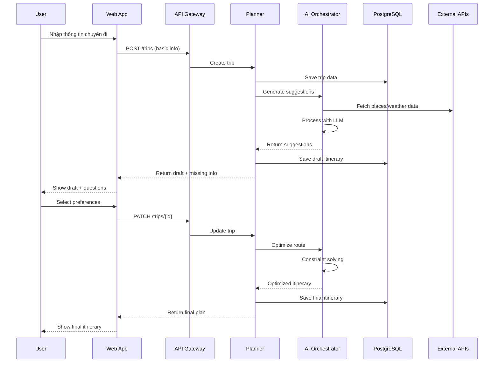

# 01 — Kiến trúc tổng quan TravelSense v2

## Sơ đồ kiến trúc system-level

```mermaid
graph TB
    subgraph "Client Layer"
        web["Web App<br/>(Next.js + React)"]
        mobile["Mobile App<br/>(React Native)"]
    end

    subgraph "API Gateway"
        gateway["API Gateway<br/>(Express/FastAPI)"]
        auth["Authentication<br/>(JWT + OAuth)"]
        rate["Rate Limiting<br/>(Redis)"]
    end

    subgraph "Core Services"
        planner["Planner Service<br/>(Orchestrator)"]
        userSvc["User Service"]
        tripSvc["Trip Service"]
        itinerarySvc["Itinerary Service"]
        exportSvc["Export Service"]
    end

    subgraph "AI Layer"
        aiOrch["AI Orchestrator"]
        cheapLLM["LLM Cheap<br/>(GPT-3.5/Claude Haiku)"]
        strictLLM["LLM Structured<br/>(GPT-4/Claude Sonnet)"]
        vectorDB["Vector Store<br/>(FAISS/pgvector)"]
        embedding["Embedding Service"]
    end

    subgraph "Data Layer"
        postgres[("PostgreSQL<br/>(Main DB)")]
        redis[("Redis<br/>(Cache + Session)")]
        fileStore[("File Storage<br/>(S3/CloudFlare R2)")]
    end

    subgraph "External APIs"
        placesAPI["Places API<br/>(Google/Foursquare)"]
        mapsAPI["Maps API<br/>(Google/OSM)"]
        weatherAPI["Weather API<br/>(OpenWeather)"]
        accommodAPI["Accommodation<br/>(Booking.com)"]
    end

    subgraph "Background Jobs"
        queue["Job Queue<br/>(Bull/RQ)"]
        optimizer["Route Optimizer"]
        crawler["Data Crawler"]
        exporter["File Exporter"]
    end

    %% Connections
    web --> gateway
    mobile --> gateway
    gateway --> auth
    gateway --> rate
    gateway --> planner

    planner --> userSvc
    planner --> tripSvc
    planner --> itinerarySvc
    planner --> exportSvc
    planner --> aiOrch

    aiOrch --> cheapLLM
    aiOrch --> strictLLM
    aiOrch --> vectorDB
    aiOrch --> embedding

    userSvc --> postgres
    tripSvc --> postgres
    itinerarySvc --> postgres
    exportSvc --> postgres
    exportSvc --> fileStore

    planner --> redis
    aiOrch --> redis
    
    planner --> placesAPI
    planner --> mapsAPI
    planner --> weatherAPI
    planner --> accommodAPI

    planner --> queue
    queue --> optimizer
    queue --> crawler
    queue --> exporter

    %% Styling
    classDef client fill:#e1f5fe
    classDef api fill:#f3e5f5
    classDef service fill:#e8f5e8
    classDef ai fill:#fff3e0
    classDef data fill:#fce4ec
    classDef external fill:#f1f8e9
    classDef bg fill:#e0f2f1

    class web,mobile client
    class gateway,auth,rate api
    class planner,userSvc,tripSvc,itinerarySvc,exportSvc service
    class aiOrch,cheapLLM,strictLLM,vectorDB,embedding ai
    class postgres,redis,fileStore data
    class placesAPI,mapsAPI,weatherAPI,accommodAPI external
    class queue,optimizer,crawler,exporter bg
```

## Giải thích từng layer

### 1. Client Layer
- **Web App**: React/Next.js cho desktop và tablet
- **Mobile App**: React Native cho iOS/Android
- Tương tác qua REST API và WebSocket cho real-time updates

### 2. API Gateway
- **Authentication**: JWT tokens + OAuth (Google/Facebook login)
- **Rate Limiting**: Bảo vệ khỏi abuse, limit theo user tier
- **Load Balancing**: Phân tải requests đến core services

### 3. Core Services (Microservices)
- **Planner Service**: Orchestrator chính, điều phối các service khác
- **User Service**: Quản lý profiles, preferences, history
- **Trip Service**: CRUD cho trips, constraints, budget
- **Itinerary Service**: Xây dựng và tối ưu lịch trình
- **Export Service**: Xuất PDF, ICS, JSON, sharing links

### 4. AI Layer
- **AI Orchestrator**: Điều phối giữa 2 loại LLM
- **Cheap LLM**: Chat, ideation, creative suggestions
- **Structured LLM**: Schema validation, constraint checking
- **Vector Store**: Semantic search cho places, activities
- **Embedding Service**: Tạo embeddings cho content

### 5. Data Layer
- **PostgreSQL**: ACID transactions, relational data
- **Redis**: Session storage, caching, pub/sub
- **File Storage**: PDFs, images, exported files

### 6. External APIs
- **Places**: POI data, reviews, photos, hours
- **Maps**: Routing, distance matrix, geocoding
- **Weather**: Forecasts, historical data
- **Accommodation**: Availability, pricing, booking

### 7. Background Jobs
- **Route Optimizer**: TSP/VRP algorithms cho multi-day trips
- **Data Crawler**: Cập nhật POI data, pricing
- **File Exporter**: Async PDF/ICS generation

## Data Flow chính

## Tính năng kỹ thuật nổi bật

### 1. Dual LLM Strategy
- **Cost Optimization**: Dùng LLM rẻ cho tasks đơn giản
- **Quality Assurance**: LLM đắt cho validation và structured output
- **Context Switching**: Automatic routing based on task type

### 2. Intelligent Caching
- **Multi-level**: Browser → Redis → PostgreSQL
- **Smart Invalidation**: TTL + event-based cache busting
- **Prefetching**: Predict next requests, warm cache

### 3. Constraint Solving
- **Real-time**: Opening hours, travel time, weather
- **Flexible**: User can override suggestions
- **Explainable**: Clear reasoning for each suggestion

### 4. Incremental Optimization
- **Local Changes**: Modify part of itinerary without full re-computation
- **Version Control**: Track changes, allow rollback
- **Conflict Resolution**: Handle concurrent edits

## Scalability & Performance

### Horizontal Scaling
- **Stateless Services**: Easy to replicate behind load balancer
- **Database Sharding**: Partition by user_id or geographic region
- **CDN**: Static assets và exported files

### Performance Targets
- **API Response**: < 500ms cho CRUD operations
- **AI Generation**: < 5s cho initial draft
- **Route Optimization**: < 10s cho complex multi-day trips
- **Export**: < 30s cho PDF generation

### Monitoring & Observability
- **Metrics**: Response times, error rates, AI costs
- **Tracing**: Distributed tracing across microservices
- **Alerting**: Automated alerts cho performance degradation
