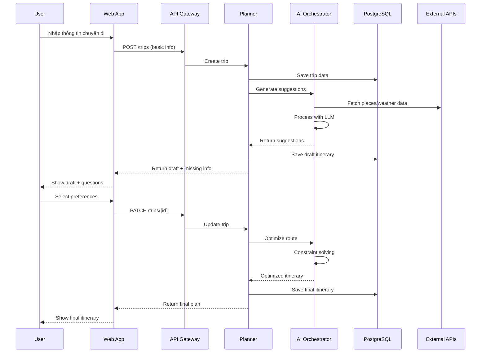

# 01 — Kiến trúc tổng quan TravelSense v2

## Sơ đồ kiến trúc system-level

```mermaid
graph TB
    subgraph "Client Layer"
        web["Web App<br/>(Next.js + React)"]
        mobile["Mobile App<br/>(React Native)"]
    end

    subgraph "API Gateway"
        gateway["API Gateway<br/>(Express/FastAPI)"]
        auth["Authentication<br/>(JWT + OAuth)"]
        rate["Rate Limiting<br/>(Redis)"]
    end

    subgraph "Core Services"
        planner["Planner Service<br/>(Orchestrator)"]
        userSvc["User Service"]
        tripSvc["Trip Service"]
        itinerarySvc["Itinerary Service"]
        exportSvc["Export Service"]
    end

    subgraph "AI Layer"
        aiOrch["AI Orchestrator"]
        cheapLLM["LLM Cheap<br/>(GPT-3.5/Claude Haiku)"]
        strictLLM["LLM Structured<br/>(GPT-4/Claude Sonnet)"]
        vectorDB["Vector Store<br/>(FAISS/pgvector)"]
        embedding["Embedding Service"]
    end

    subgraph "Data Layer"
        postgres[("PostgreSQL<br/>(Main DB)")]
        redis[("Redis<br/>(Cache + Session)")]
        fileStore[("File Storage<br/>(S3/CloudFlare R2)")]
    end

    subgraph "External APIs"
        placesAPI["Places API<br/>(Google/Foursquare)"]
        mapsAPI["Maps API<br/>(Google/OSM)"]
        weatherAPI["Weather API<br/>(OpenWeather)"]
        accommodAPI["Accommodation<br/>(Booking.com)"]
    end

    subgraph "Background Jobs"
        queue["Job Queue<br/>(Bull/RQ)"]
        optimizer["Route Optimizer"]
        crawler["Data Crawler"]
        exporter["File Exporter"]
    end

    %% Connections
    web --> gateway
    mobile --> gateway
    gateway --> auth
    gateway --> rate
    gateway --> planner

    planner --> userSvc
    planner --> tripSvc
    planner --> itinerarySvc
    planner --> exportSvc
    planner --> aiOrch

    aiOrch --> cheapLLM
    aiOrch --> strictLLM
    aiOrch --> vectorDB
    aiOrch --> embedding

    userSvc --> postgres
    tripSvc --> postgres
    itinerarySvc --> postgres
    exportSvc --> postgres
    exportSvc --> fileStore

    planner --> redis
    aiOrch --> redis
    
    planner --> placesAPI
    planner --> mapsAPI
    planner --> weatherAPI
    planner --> accommodAPI

    planner --> queue
    queue --> optimizer
    queue --> crawler
    queue --> exporter

    %% Styling
    classDef client fill:#e1f5fe
    classDef api fill:#f3e5f5
    classDef service fill:#e8f5e8
    classDef ai fill:#fff3e0
    classDef data fill:#fce4ec
    classDef external fill:#f1f8e9
    classDef bg fill:#e0f2f1

    class web,mobile client
    class gateway,auth,rate api
    class planner,userSvc,tripSvc,itinerarySvc,exportSvc service
    class aiOrch,cheapLLM,strictLLM,vectorDB,embedding ai
    class postgres,redis,fileStore data
    class placesAPI,mapsAPI,weatherAPI,accommodAPI external
    class queue,optimizer,crawler,exporter bg
```

## Kiến trúc chi tiết theo từng layer

**Client Layer** được thiết kế đa nền tảng với Web App sử dụng React/Next.js cho desktop và tablet, kết hợp Mobile App React Native cho iOS/Android. Cả hai đều tương tác với backend qua REST API cho các thao tác CRUD chuẩn và WebSocket cho real-time updates khi người dùng đang chỉnh sửa lịch trình, cho phép trải nghiệm tương tác mượt mà và cập nhật tức thì khi tính toán lại tuyến đường hoặc chi phí.

**API Gateway** đóng vai trò trung gian quan trọng với hệ thống authentication sử dụng JWT tokens kết hợp OAuth để người dùng có thể đăng nhập qua Google/Facebook một cách tiện lợi. Rate limiting được cấu hình theo user tier để bảo vệ khỏi abuse (free users: 100 requests/hour, premium: 1000 requests/hour), đồng thời load balancing phân tải requests đến các core services để đảm bảo hiệu năng ổn định ngay cả khi traffic tăng cao.

**Core Services** áp dụng kiến trúc microservices với 5 service chính: Planner Service là orchestrator điều phối các service khác và chứa logic nghiệp vụ chính; User Service quản lý profiles, preferences và trip history; Trip Service xử lý CRUD cho trips, constraints và budget; Itinerary Service chuyên về xây dựng và tối ưu lịch trình với các algorithms phức tạp; Export Service chịu trách nhiệm xuất PDF, ICS, JSON và tạo sharing links với khả năng scale riêng biệt.

**AI Layer** là trái tim của hệ thống với AI Orchestrator điều phối giữa 2 loại LLM theo chiến lược cost-efficient: Cheap LLM (GPT-3.5/Claude Haiku) xử lý chat, ideation và creative suggestions; Structured LLM (GPT-4/Claude Sonnet) đảm nhận schema validation và constraint checking quan trọng. Vector Store cung cấp semantic search cho places và activities, trong khi Embedding Service tạo embeddings cho content để tìm kiếm tương tự thông minh.

**Data Layer** kết hợp 3 loại storage khác nhau: PostgreSQL cho ACID transactions và relational data chính; Redis cho session storage, caching multi-level và pub/sub messaging; File Storage (S3/CloudFlare R2) cho PDFs, images và exported files với CDN global distribution. **External APIs** tích hợp đa dạng nguồn dữ liệu: Places APIs cung cấp POI data với reviews, photos và opening hours; Maps APIs xử lý routing, distance matrix và geocoding; Weather APIs cung cấp forecasts và historical data; Accommodation APIs đa dạng từ hotels đến vacation rentals với availability, pricing và booking capabilities.

**Background Jobs** xử lý các tác vụ nặng và dài: Route Optimizer chạy TSP/VRP algorithms cho multi-day trips phức tạp; Data Crawler thường xuyên cập nhật POI data và pricing từ nhiều nguồn; File Exporter xử lý async PDF/ICS generation để không block main thread, tất cả đều được quản lý qua message queue với retry logic và error handling.

## Data Flow chính

## Tính năng kỹ thuật nổi bật

### 1. Dual LLM Strategy
- **Cost Optimization**: Dùng LLM rẻ cho tasks đơn giản
- **Quality Assurance**: LLM đắt cho validation và structured output
- **Context Switching**: Automatic routing based on task type

### 2. Intelligent Caching
- **Multi-level**: Browser → Redis → PostgreSQL
- **Smart Invalidation**: TTL + event-based cache busting
- **Prefetching**: Predict next requests, warm cache

### 3. Constraint Solving
- **Real-time**: Opening hours, travel time, weather
- **Flexible**: User can override suggestions
- **Explainable**: Clear reasoning for each suggestion

### 4. Incremental Optimization
- **Local Changes**: Modify part of itinerary without full re-computation
- **Version Control**: Track changes, allow rollback
- **Conflict Resolution**: Handle concurrent edits

## Scalability & Performance

### Horizontal Scaling
- **Stateless Services**: Easy to replicate behind load balancer
- **Database Sharding**: Partition by user_id or geographic region
- **CDN**: Static assets và exported files

### Performance Targets
- **API Response**: < 500ms cho CRUD operations
- **AI Generation**: < 5s cho initial draft
- **Route Optimization**: < 10s cho complex multi-day trips
- **Export**: < 30s cho PDF generation

### Monitoring & Observability
- **Metrics**: Response times, error rates, AI costs
- **Tracing**: Distributed tracing across microservices
- **Alerting**: Automated alerts cho performance degradation
