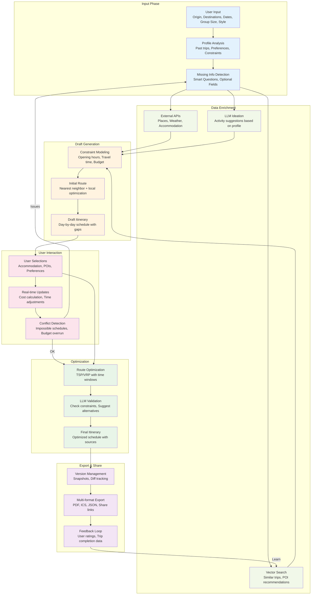
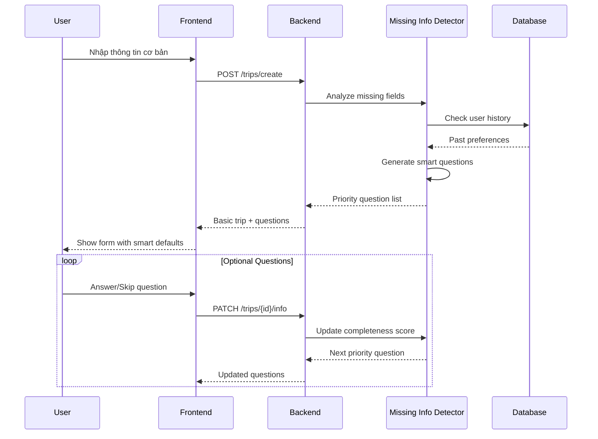
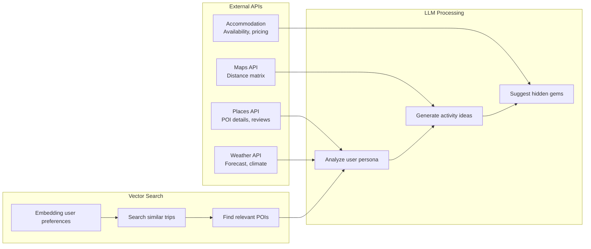
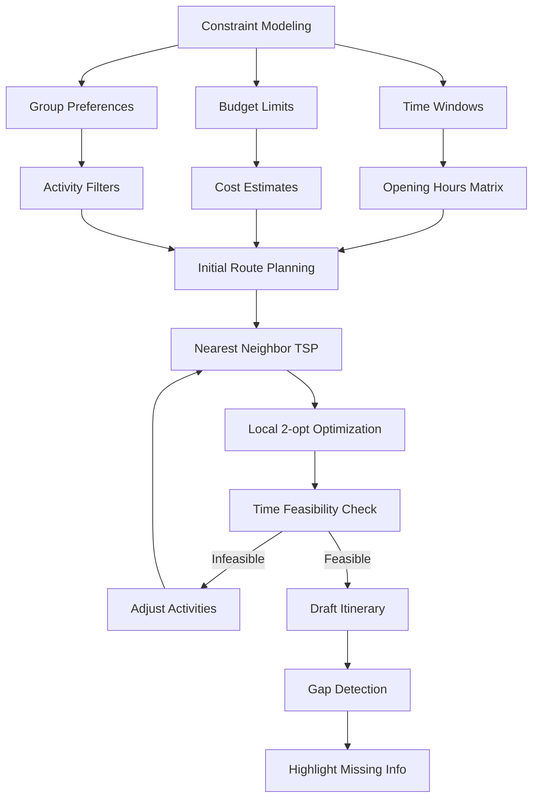
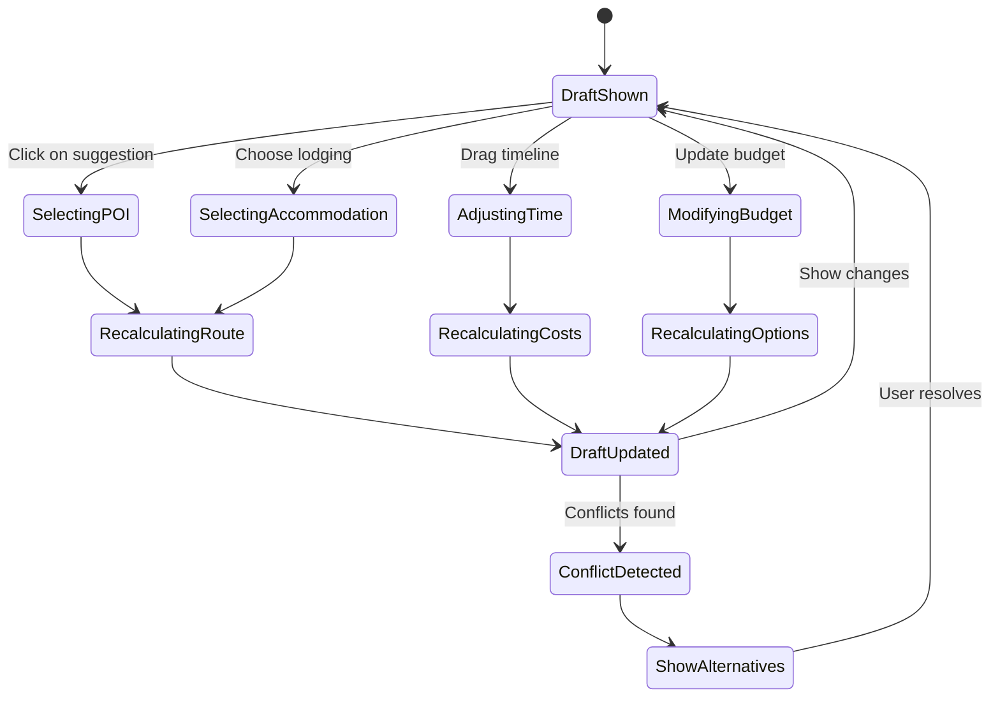
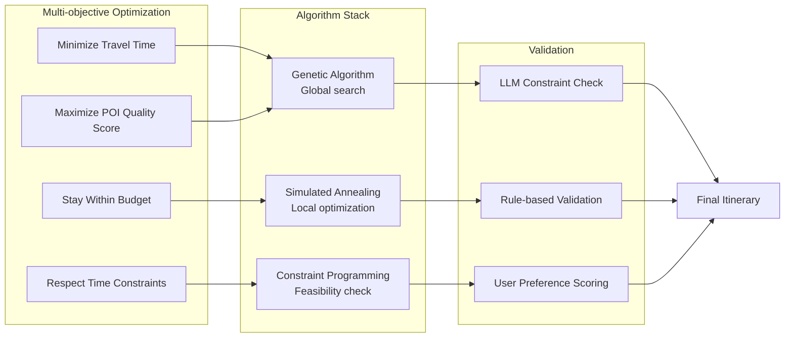
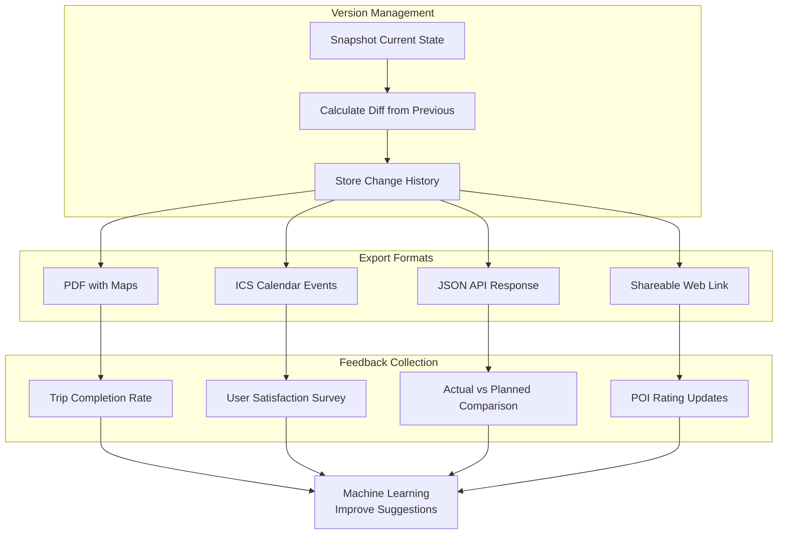
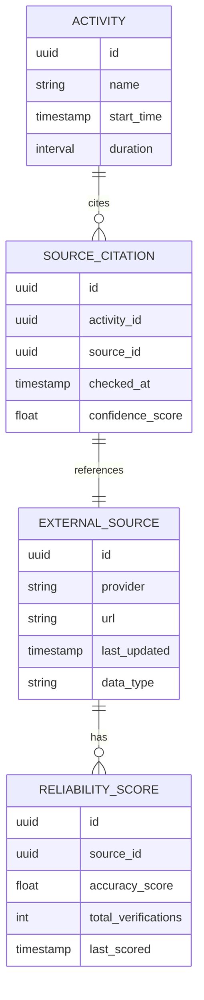

# 02 — Luồng dữ liệu chi tiết TravelSense v2

## Luồng dữ liệu end-to-end

## Chi tiết từng giai đoạn

### 1. Input Phase - Thu thập dữ liệu thông minh

**Thông tin cơ bản thu thập:**
- **Bắt buộc**: Origin, Destinations, Date range, Group size
- **Tùy chọn thông minh**: Budget range, Travel style, Special needs
- **Suy luận từ profile**: Past destinations, Preferred activities, Spending patterns

### 2. Data Enrichment - Làm giàu dữ liệu

**Dữ liệu được làm giàu:**
- **POI Data**: Tên, tọa độ, giờ mở cửa, giá vé, reviews
- **Weather Context**: Thời tiết dự báo, mùa vụ, điều kiện đặc biệt
- **Accommodation Options**: Khách sạn/homestay theo budget và vị trí
- **Activity Suggestions**: Dựa trên profile và POI similarity

### 3. Draft Generation - Tạo nháp lịch trình

**Constraint Types:**
- **Time Constraints**: POI opening hours, minimum visit duration
- **Budget Constraints**: Per-category spending limits
- **Physical Constraints**: Walking distance, transportation time
- **Group Constraints**: Kids-friendly, accessibility needs

### 4. User Interaction - Tương tác thời gian thực

**Real-time Calculations:**
- **Route Updates**: Khi thêm/bớt POI, tính lại optimal path
- **Cost Changes**: Update budget breakdown theo real-time
- **Time Conflicts**: Detect scheduling impossibilities
- **Alternative Suggestions**: Provide fallback options

### 5. Optimization - Tối ưu hóa cuối cùng

**Optimization Objectives:**
- **Primary**: Feasibility (tất cả constraints thỏa mãn)
- **Secondary**: User satisfaction score
- **Tertiary**: Cost efficiency
- **Quaternary**: Travel time minimization

### 6. Export & Feedback - Xuất và học hỏi

## Data Quality & Reliability

### Source Citation System

### Cache Strategy
- **L1 Cache**: Browser localStorage (user preferences, recent searches)
- **L2 Cache**: Redis (API responses, computed routes)
- **L3 Cache**: PostgreSQL materialized views (aggregated data)
- **TTL Strategy**: Dynamic TTL based on data volatility (weather: 1h, POI: 24h, maps: 1 week)
