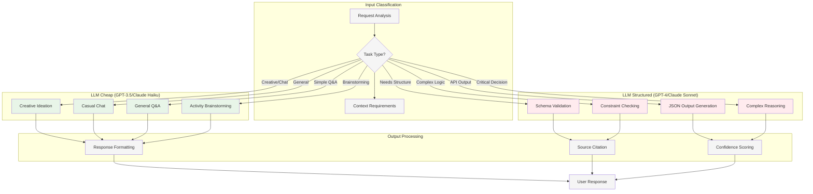
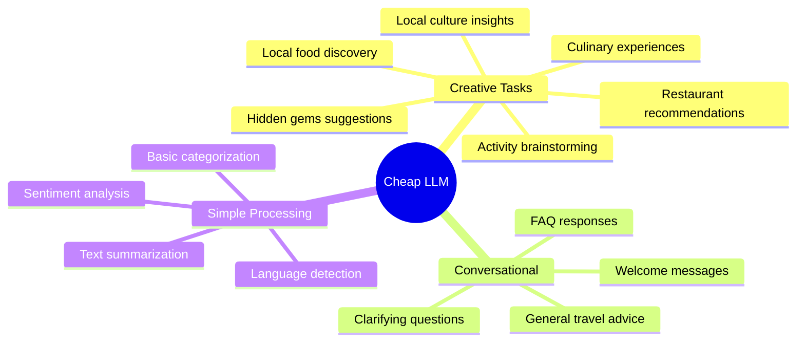
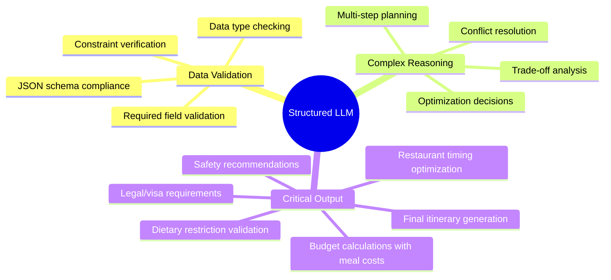
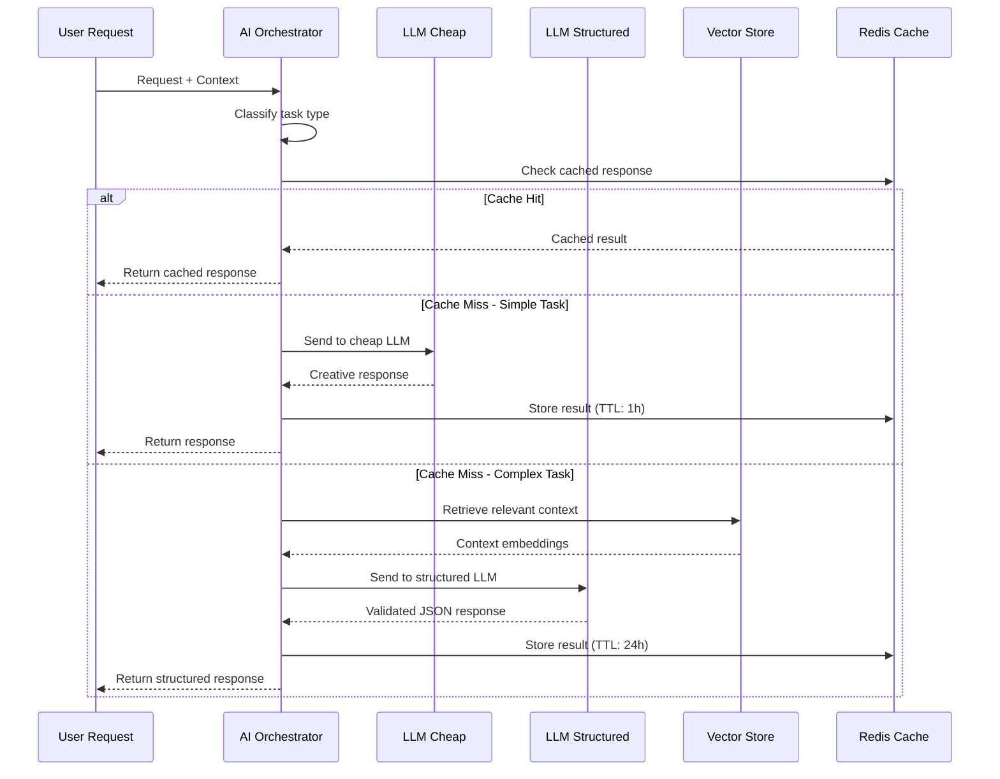
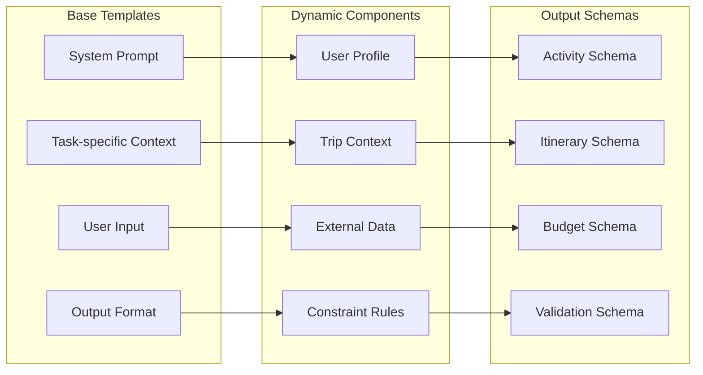
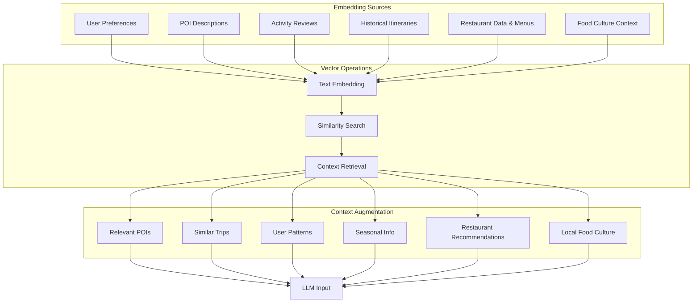
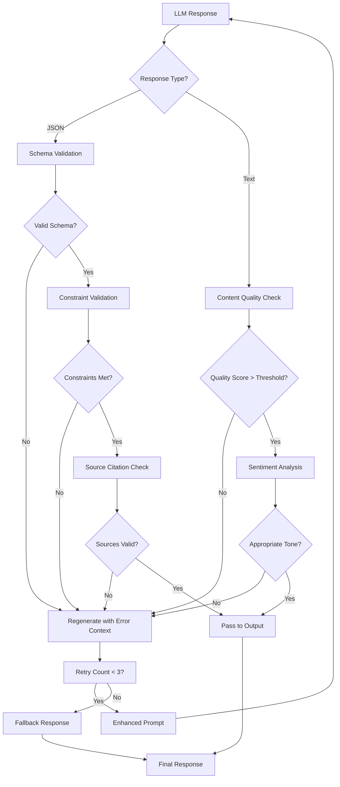
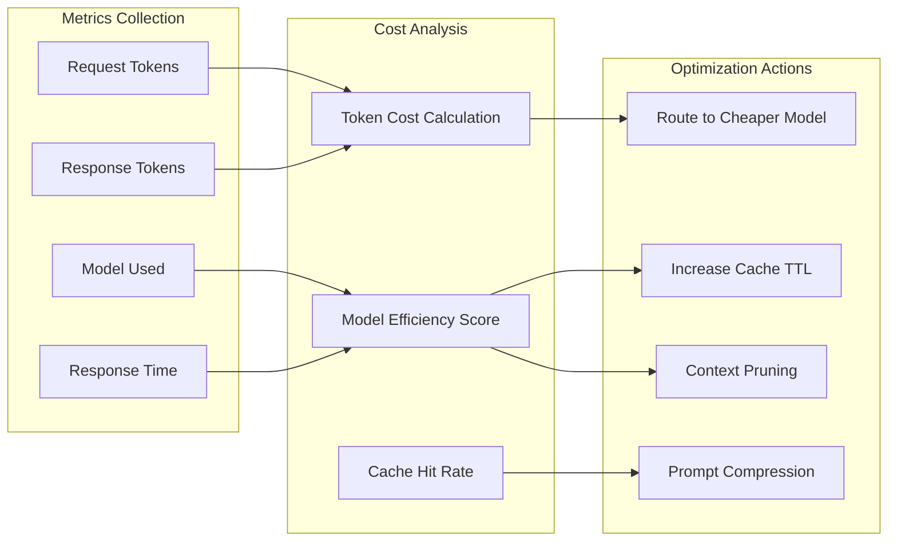
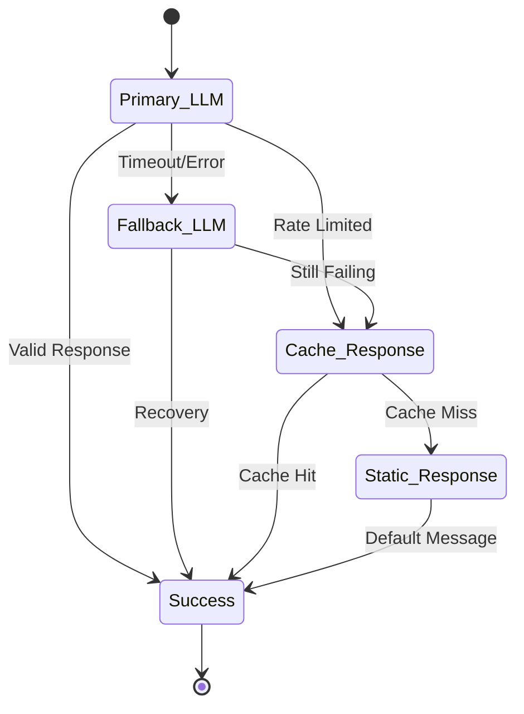

# 03 — AI Orchestration Strategy TravelSense v2

## Dual LLM Architecture



## Task Routing Logic

## Detailed Task Routing Strategy 

### Cheap LLM Tasks (Cost-Optimized cho high-frequency, creative workflows)


### Structured LLM Tasks (Quality-Critical cho business-logic và validation)


## AI Orchestrator Implementation



## Prompt Engineering Strategy

### Template System


### Sample Prompt Templates

#### Cheap LLM - Activity Brainstorming
```
System: You are a creative travel assistant. Generate activity ideas based on user preferences.

Context:
- Destination: {destination}
- Travel Style: {style}
- Group: {group_type}
- Season: {season}

User Input: {user_request}

Output: Provide 5-7 creative activity suggestions with brief descriptions. Be enthusiastic but realistic.
```

#### Cheap LLM - Restaurant & Food Discovery
```
System: You are a local food expert and culinary travel assistant. Suggest authentic dining experiences and local food discoveries.

Context:
- Destination: {destination}
- Cuisine Preferences: {cuisine_types}
- Dietary Restrictions: {dietary_restrictions}
- Budget Range: {food_budget}
- Meal Type: {meal_type}
- Group Size: {group_size}
- Local Food Culture: {local_food_context}

User Input: {user_request}

Guidelines:
- Prioritize authentic local experiences over tourist restaurants
- Include street food and hidden gems when appropriate
- Consider opening hours and location convenience
- Mention must-try local dishes and specialties
- Balance budget with quality recommendations

Output: Provide 5-7 dining suggestions with:
- Restaurant/venue name and type
- Signature dishes or specialties
- Price range and ambiance
- Why it's special for travelers
- Best timing to visit
```

#### Structured LLM - Itinerary Validation
```
System: You are a precise travel planning validator. Check itinerary feasibility and return structured JSON.

Schema: {itinerary_schema}

Constraints:
- Opening hours: {opening_hours_data}
- Travel times: {travel_matrix}
- Budget limits: {budget_constraints}
- Group needs: {group_requirements}

Input Itinerary: {draft_itinerary}

Task: Validate the itinerary and return JSON with:
1. is_valid: boolean
2. violations: array of constraint violations
3. suggestions: array of improvements
4. confidence_score: 0-1

Output must be valid JSON only.
```

#### Structured LLM - Meal Planning Integration
```
System: You are a precise meal planning optimizer. Integrate restaurant visits into travel itineraries with timing and budget validation.

Schema: {meal_planning_schema}

Constraints:
- Restaurant opening hours: {restaurant_hours}
- Travel times between venues: {travel_matrix}
- Meal timing preferences: {meal_windows}
- Dietary restrictions: {dietary_constraints}
- Daily food budget: {food_budget_limits}
- Group preferences: {group_dining_needs}

Input Data:
- Current itinerary: {current_itinerary}
- Restaurant options: {restaurant_candidates}
- User meal preferences: {meal_preferences}

Task: Generate optimized meal schedule and return JSON with:
1. meal_schedule: array of scheduled meals with timing
2. restaurant_assignments: matched restaurants for each meal
3. budget_breakdown: cost allocation per meal/day
4. timing_conflicts: any scheduling issues
5. alternative_options: backup restaurants for flexibility
6. dietary_compliance: validation of restrictions met
7. optimization_score: 0-1 based on preferences match

Optimization Priorities:
1. Respect dietary restrictions (critical)
2. Stay within budget constraints
3. Minimize travel time between activities
4. Match authentic local experience preferences
5. Consider restaurant busy times and quality

Output must be valid JSON only.
```

## Context Management

### Vector Store Integration


### Advanced Context Window Management & Optimization

**TravelSense v2** sử dụng sophisticated context management để maximize hiệu quả của cả hai LLM tiers. **Context Window Allocation** được tối ưu với max 8K tokens cho cheap LLM (đủ cho creative tasks bao gồm restaurant recommendations) và 32K tokens cho structured LLM (handle complex reasoning với nhiều constraints về timing, budget và dietary requirements). **Dynamic Priority Ranking** áp dụng weighted scoring: User input (weight: 1.0), Current trip context (0.8), Relevant POI & restaurant data (0.6), Dietary restrictions & food preferences (0.7), Historical patterns (0.4), và General knowledge (0.2). **Intelligent Truncation Strategy** giữ lại most recent user interactions, most relevant context from vector search, core constraint data và critical dietary information, đồng thời compress generic information thành summaries để tiết kiệm tokens mà vẫn preserve essential context.

## Quality Assurance

### Response Validation Pipeline


## Cost Optimization

### Token Usage Monitoring


### Cost Targets
- **Average Cost per Trip**: < $0.50
- **Cheap LLM Usage**: 70% of requests
- **Structured LLM Usage**: 30% of requests
- **Cache Hit Rate**: > 60%

## Error Handling & Fallbacks

### Graceful Degradation


### Fallback Strategies
1. **Model Fallback**: GPT-4 → GPT-3.5 → Claude → Static response
2. **Cache Fallback**: Recent response → Similar request → Generic template
3. **Feature Fallback**: Full itinerary → Basic suggestions → Error message
4. **Timeout Handling**: Async processing → Progress updates → Partial results

## AI Ethics & Safety

### Content Filtering
- **Input Sanitization**: Prevent prompt injection
- **Output Monitoring**: Check for harmful content
- **Bias Detection**: Monitor for cultural/demographic bias
- **Privacy Protection**: No personal data in training

### Transparency
- **Source Attribution**: All suggestions cite sources
- **Confidence Scores**: Indicate AI certainty level
- **Human Override**: Allow manual corrections
- **Explainability**: Show reasoning for suggestions
