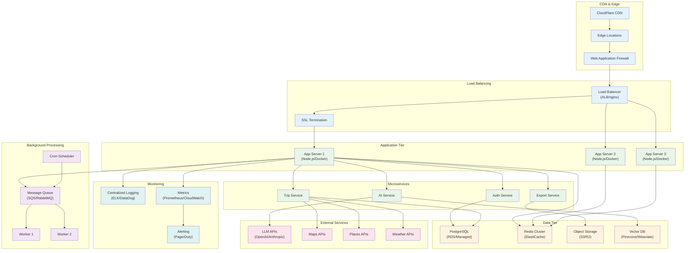
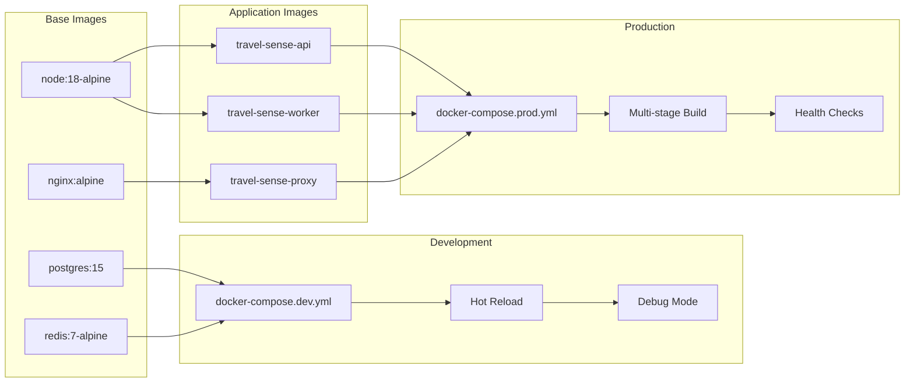
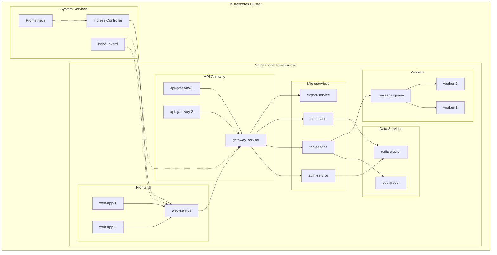
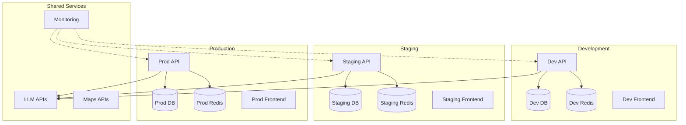
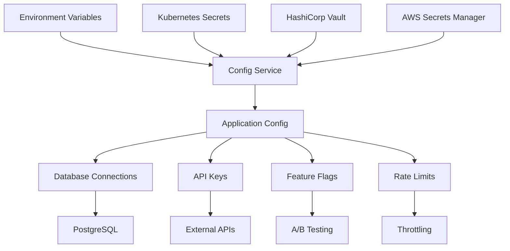
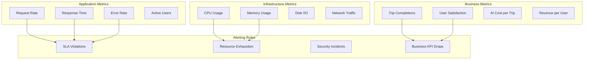
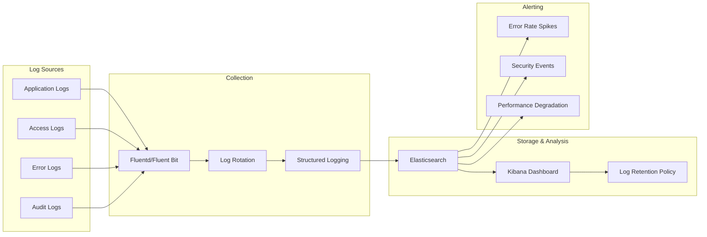
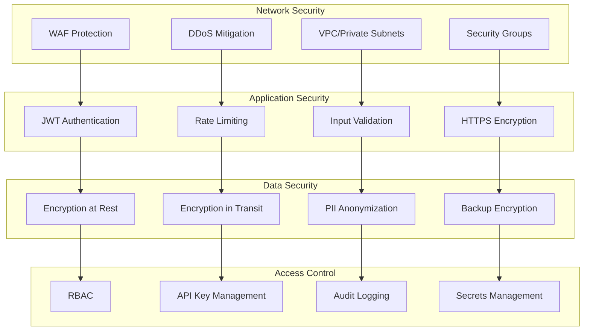
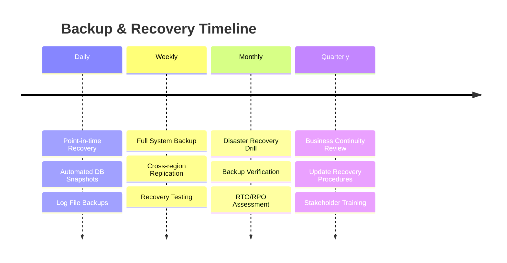

# 04 — Deployment & Infrastructure TravelSense v2

## Cloud Architecture



## Container Strategy

### Docker Configuration


### Multi-stage Dockerfile
```dockerfile
# Build stage
FROM node:18-alpine AS builder
WORKDIR /app
COPY package*.json ./
RUN npm ci --only=production

# Runtime stage
FROM node:18-alpine AS runtime
RUN addgroup -g 1001 -S nodejs
RUN adduser -S nextjs -u 1001
WORKDIR /app
COPY --from=builder /app/node_modules ./node_modules
COPY --chown=nextjs:nodejs . .
USER nextjs
EXPOSE 3000
CMD ["npm", "start"]
```

## Kubernetes Deployment

### Service Mesh Architecture


### Resource Allocation
```yaml
# Kubernetes Resource Limits
apiVersion: v1
kind: ResourceQuota
metadata:
  name: travel-sense-quota
spec:
  hard:
    requests.cpu: "4"
    requests.memory: 8Gi
    limits.cpu: "8"
    limits.memory: 16Gi
    pods: "20"
    persistentvolumeclaims: "5"
```

## CI/CD Pipeline

```mermaid
flowchart LR
    subgraph "Source Control"
        A[Git Push]
        B[Pull Request]
        C[Main Branch]
    end

    subgraph "CI Pipeline"
        D[Code Quality<br/>ESLint, Prettier]
        E[Unit Tests<br/>Jest, Vitest]
        F[Integration Tests<br/>Playwright]
        G[Security Scan<br/>Snyk, SonarQube]
    end

    subgraph "Build & Package"
        H[Docker Build]
        I[Image Scan<br/>Trivy, Clair]
        J[Push to Registry<br/>ECR, DockerHub]
    end

    subgraph "Deploy Stages"
        K[Dev Environment]
        L[Staging Environment]
        M[Production Environment]
    end

    subgraph "Post-Deploy"
        N[Health Checks]
        O[Smoke Tests]
        P[Performance Tests]
        Q[Rollback if Needed]
    end

    A --> D
    B --> D
    C --> D

    D --> E --> F --> G
    G --> H --> I --> J

    J --> K
    K -->|Auto| L
    L -->|Manual Approval| M

    M --> N --> O --> P
    P -->|Failed| Q
    Q --> L
```



### GitHub Actions Workflow
```yaml
name: CI/CD Pipeline

on:
  push:
    branches: [main, develop]
  pull_request:
    branches: [main]

jobs:
  test:
    runs-on: ubuntu-latest
    steps:
      - uses: actions/checkout@v3
      - uses: actions/setup-node@v3
        with:
          node-version: '18'
      - run: npm ci
      - run: npm run test
      - run: npm run test:e2e

  build:
    needs: test
    runs-on: ubuntu-latest
    steps:
      - uses: actions/checkout@v3
      - name: Build Docker image
        run: docker build -t travel-sense:${{ github.sha }} .
      - name: Push to registry
        run: docker push travel-sense:${{ github.sha }}

  deploy:
    needs: build
    runs-on: ubuntu-latest
    if: github.ref == 'refs/heads/main'
    steps:
      - name: Deploy to Kubernetes
        run: kubectl set image deployment/api api=travel-sense:${{ github.sha }}
```

## Environment Configuration

### Environment Separation


### Configuration Management


## Monitoring & Observability

### Metrics Dashboard


### Log Aggregation


## Security Hardening

### Security Layers


## Disaster Recovery

### Backup Strategy


### Multi-region Deployment
- **Primary Region**: US-East (Virginia)
- **Secondary Region**: EU-West (Ireland)
- **Failover Time**: < 5 minutes (automated)
- **Data Sync**: Real-time replication with 15-second lag
- **Recovery Objectives**: RTO < 1 hour, RPO < 5 minutes
