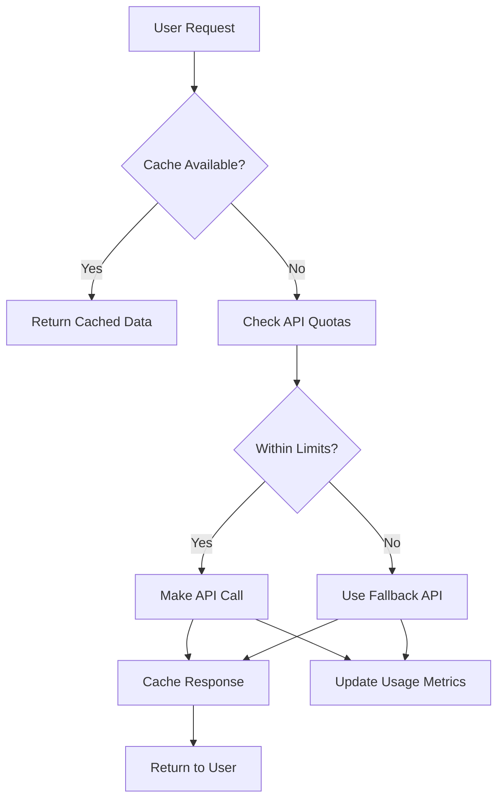
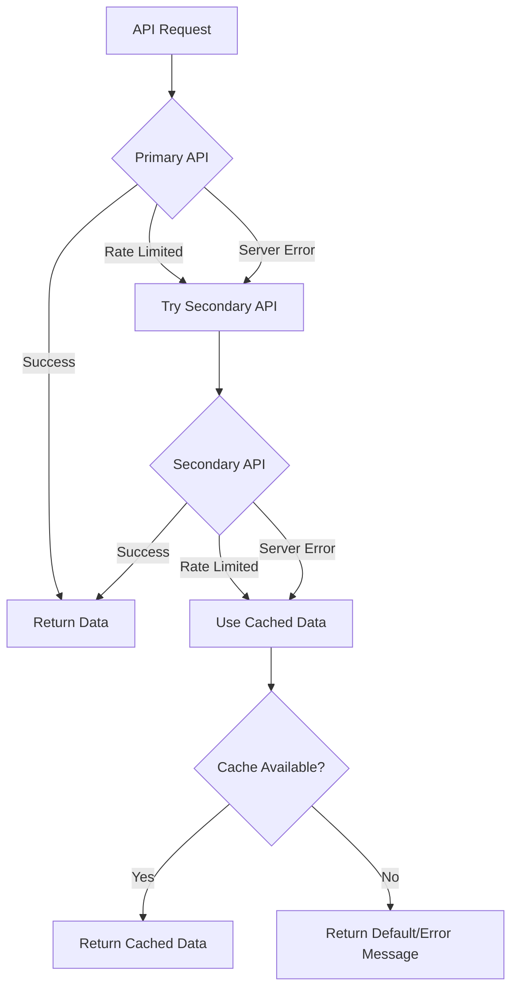

# 05 — API miễn phí cho TravelSense v2

## Danh sách API miễn phí và rẻ

### 🗺️ Maps & Geocoding

#### OpenStreetMap (Hoàn toàn miễn phí)
```yaml
Service: Nominatim Geocoding
Endpoint: https://nominatim.openstreetmap.org/
Limits: 1 request/second, fair use policy
Features:
  - Geocoding/Reverse geocoding
  - Address lookup
  - Points of Interest
  - No API key required
Usage: "Tìm tọa độ địa điểm, reverse geocoding"
```

#### MapBox (Free tier)
```yaml
Service: MapBox APIs
Endpoint: https://api.mapbox.com/
Free Tier: 50,000 requests/month
Features:
  - Maps, Geocoding, Directions
  - Matrix API (travel times)
  - Static maps
API Key: Required (free signup)
Usage: "Tính toán tuyến đường, ma trận thời gian di chuyển"
```

### 🌤️ Weather Data

#### OpenWeatherMap (Free tier)
```yaml
Service: OpenWeatherMap API
Endpoint: https://api.openweathermap.org/
Free Tier: 1000 calls/day, 60 calls/minute
Features:
  - Current weather
  - 5-day forecast
  - Historical data (limited)
  - Weather alerts
API Key: Required (free signup)
Usage: "Dự báo thời tiết cho lịch trình"
```

#### WeatherAPI (Free tier)
```yaml
Service: WeatherAPI
Endpoint: https://api.weatherapi.com/
Free Tier: 1 million calls/month
Features:
  - Current conditions
  - 3-day forecast
  - Historical weather
  - Astronomy data
API Key: Required (free signup)
Usage: "Backup cho OpenWeatherMap, dữ liệu chi tiết hơn"
```

### 📍 Places & Points of Interest

#### Foursquare Places API (Free tier)
```yaml
Service: Foursquare Places
Endpoint: https://api.foursquare.com/
Free Tier: 1000 calls/day
Features:
  - Venue search
  - Venue details
  - Photos, tips, hours
  - Categories and ratings
API Key: Required (free signup)
Usage: "Tìm kiếm địa điểm ăn uống, giải trí, tham quan"
```

### 🍽️ Restaurant & Food APIs

#### Zomato API (Free tier)
```yaml
Service: Zomato Restaurant API
Endpoint: https://developers.zomato.com/api/
Free Tier: 1000 calls/day
Features:
  - Restaurant search by location
  - Menu details & pricing
  - Reviews & ratings
  - Cuisine types & filters
  - Operating hours
  - Delivery/booking options
API Key: Required (free signup)
Usage: "Tìm kiếm nhà hàng, menu, giá cả và đánh giá"
```

#### Yelp Fusion API (Free tier)
```yaml
Service: Yelp Fusion API
Endpoint: https://api.yelp.com/v3/
Free Tier: 5000 calls/day
Features:
  - Business search (restaurants/cafes)
  - Reviews & photos
  - Operating hours
  - Price range indicators
  - Popular dishes/categories
API Key: Required (free signup)
Usage: "Tìm kiếm nhà hàng với reviews chi tiết và photos"
```

#### OpenMenu API (Free)
```yaml
Service: OpenMenu
Endpoint: https://openmenu.com/api/
Free Tier: No hard limits
Features:
  - Restaurant menus
  - Dish details & pricing
  - Nutritional information
  - Dietary restrictions
  - Multi-language support
API Key: Required (free signup)
Usage: "Lấy thông tin menu chi tiết và giá cả món ăn"
```

#### TripAdvisor Restaurant API (Limited Free)
```yaml
Service: TripAdvisor Content API
Endpoint: https://developer-tripadvisor.com/
Free Tier: 10,000 requests/month
Features:
  - Restaurant listings
  - Traveler reviews
  - Photos & rankings
  - Award badges
  - Price range & cuisine
Requirements: Application approval
Usage: "Reviews uy tín từ travelers, ranking nhà hàng"
```

#### Google Places API - Restaurant Focus
```yaml
Service: Google Places API (Restaurant filtering)
Endpoint: https://maps.googleapis.com/maps/api/place/
Free Tier: $200 credit/month
Features:
  - Restaurant search with type=restaurant
  - Operating hours & popular times
  - Price levels ($ to $$$$)
  - Reviews & ratings
  - Photos & contact info
  - Real-time busy status
API Key: Required (credit card verification)
Usage: "Dữ liệu nhà hàng chất lượng cao với popular times"
```

#### FourSquare Venue Categories - Food Specific
```yaml
Food Categories:
  - Restaurant (categoryId: 4d4b7105d754a06374d81259)
  - Fast Food (categoryId: 4bf58dd8d48988d16e941735)
  - Coffee Shop (categoryId: 4bf58dd8d48988d1e0931735)
  - Bar (categoryId: 4bf58dd8d48988d116941735)
  - Street Food (categoryId: 4f04af1f2fb6e1c99f3db0bb)
  - Local Cuisine specific categories
Usage: "Tìm kiếm chính xác theo loại hình ăn uống"
```

#### Local Food APIs (Vietnam Focus)

##### Foody API (Unofficial)
```yaml
Service: Foody.vn Scraping
Endpoint: Web scraping với respect rate limits
Free: Yes (với responsible scraping)
Features:
  - Vietnamese restaurant database
  - Local reviews & ratings
  - Delivery options
  - Price ranges in VND
  - Vietnamese cuisine specialties
Usage: "Database nhà hàng Việt Nam comprehensive"
```

##### Now.vn Restaurant API
```yaml
Service: Now.vn Delivery Platform
Endpoint: Partner API hoặc web scraping
Free Tier: Partner program
Features:
  - Restaurant delivery options
  - Menu with Vietnamese pricing
  - Popular Vietnamese dishes
  - Local restaurant chains
Usage: "Thông tin giao hàng và menu Việt Nam"
```

#### Street Food & Local Cuisine APIs

##### iFood API (Latin America - reference model)
```yaml
Service: iFood Developer API
Endpoint: https://developer.ifood.com.br/
Free Tier: Testing environment
Features:
  - Local restaurant database
  - Street food vendors
  - Popular local dishes
  - Price in local currency
Usage: "Model để tích hợp local food sources"
```

##### Local Food Discovery APIs
```yaml
Approach: Community-driven data
Sources:
  - OpenStreetMap amenity=restaurant tags
  - WikiData restaurant entries
  - Facebook Places API (limited)
  - Instagram location tags (public)
Features:
  - Local hidden gems
  - Street food locations
  - Market food courts
  - Traditional cuisine spots
Usage: "Khám phá ẩm thực địa phương authentic"
```

#### Google Places API (Free tier)
```yaml
Service: Google Places API
Endpoint: https://maps.googleapis.com/maps/api/place/
Free Tier: $200 credit/month (~40,000 requests)
Features:
  - Place search
  - Place details
  - Photos, reviews
  - Opening hours
API Key: Required (credit card for verification)
Usage: "Dữ liệu địa điểm chất lượng cao, reviews"
```

#### Overpass API (Hoàn toàn miễn phí)
```yaml
Service: OpenStreetMap Overpass
Endpoint: https://overpass-api.de/api/
Limits: Fair use policy, no hard limits
Features:
  - POI data from OSM
  - Amenities, tourism spots
  - Custom queries
  - Real-time data
API Key: Not required
Usage: "Tìm kiếm POI theo category, backup data source"
```

### 🏨 Accommodation APIs (Mở rộng)

#### Booking.com Affiliate API (Miễn phí với commission)
```yaml
Service: Booking.com Partner API
Endpoint: https://partner-api.booking.com/
Cost: Free (commission-based revenue)
Features:
  - Hotel search by location/dates
  - Real-time availability & pricing
  - Hotel details, photos, reviews
  - Booking capabilities with commission
  - Multi-language support
Requirements: Affiliate partnership approval
Usage: "Primary hotel source với revenue sharing"
```

#### Agoda Affiliate API
```yaml
Service: Agoda Affiliate Partner API
Endpoint: https://affiliates.agoda.com/
Cost: Free (commission-based)
Features:
  - Hotel/resort search
  - Asia-focused inventory
  - Competitive pricing
  - Instant booking confirmation
Requirements: Affiliate approval
Usage: "Strong cho thị trường Châu Á, backup cho Booking.com"
```

#### Expedia Partner Solutions
```yaml
Service: Expedia Rapid API
Endpoint: https://developers.expediagroup.com/
Free Tier: 1000 requests/day for testing
Features:
  - Hotel search & booking
  - Property details & amenities
  - Rate shopping & availability
  - Multi-property types
Cost: Transaction-based after free tier
Usage: "Enterprise-level hotel aggregator"
```

#### Hotels.com API (via RapidAPI)
```yaml
Service: Hotels.com via RapidAPI
Endpoint: https://rapidapi.com/apidojo/api/hotels-com-provider/
Cost: $0-25/month for 10K requests
Features:
  - Hotel search by city/coordinates
  - Detailed property information
  - Guest reviews & ratings
  - Price comparison
Usage: "Additional hotel inventory source"
```

#### Hostelworld API
```yaml
Service: Hostelworld Affiliate API
Endpoint: https://developer.hostelworld.com/
Free Tier: 1000 requests/month
Features:
  - Hostel/backpacker accommodation
  - Dorm & private room options
  - Budget-focused inventory
  - Young traveler reviews
Requirements: Affiliate partnership
Usage: "Budget accommodation cho backpackers"
```

#### Airbnb Alternative APIs

##### RentByOwner API
```yaml
Service: RentByOwner via RapidAPI
Endpoint: https://rapidapi.com/rental-api/
Cost: $10-50/month
Features:
  - Vacation rental properties
  - Whole home/apartment rentals
  - Owner-direct bookings
  - Alternative to Airbnb
Usage: "Vacation rental backup"
```

##### VRBO/HomeAway API
```yaml
Service: VRBO API (via Expedia Group)
Endpoint: https://developers.expediagroup.com/
Cost: Similar to Expedia Rapid
Features:
  - Vacation rental homes
  - Family-friendly properties
  - Whole property rentals
  - Kitchen/amenity details
Usage: "Family vacation rental focus"
```

#### Local/Regional APIs

##### Agoda API (Asia-Pacific)
```yaml
Service: Agoda Partner API
Endpoint: https://www.agoda.com/partners/
Strong Coverage: Thailand, Vietnam, Malaysia, Philippines
Features:
  - Local hotel partnerships
  - Competitive rates for Asia
  - Local language support
Usage: "Primary cho thị trường Đông Nam Á"
```

##### OYO Rooms API
```yaml
Service: OYO Partner API  
Endpoint: https://www.oyorooms.com/partners/
Coverage: India, Southeast Asia, Europe
Free Tier: Partner program
Features:
  - Budget hotel chain
  - Standardized amenities
  - Young traveler focused
Usage: "Budget chain hotels"
```

#### Aggregator APIs

##### Kayak API (via RapidAPI)
```yaml
Service: Kayak Hotel Search
Endpoint: https://rapidapi.com/kayak/api/kayak/
Cost: $0-100/month based on usage
Features:
  - Meta-search across providers
  - Price comparison
  - Deal alerts
  - Multi-provider results
Usage: "Price comparison & deal finding"
```

##### Trivago API
```yaml
Service: Trivago Hotel Comparison
Endpoint: https://developer.trivago.com/
Free Tier: Limited for testing
Features:
  - Hotel price comparison
  - Multiple booking sites
  - Deal scoring
  - Visual comparison tools
Usage: "Price comparison interface"
```

### 🚌 Transportation

#### Rome2rio API (Free tier)
```yaml
Service: Rome2rio
Endpoint: https://free.rome2rio.com/api/
Free Tier: 1000 requests/month
Features:
  - Multi-modal transport
  - Route planning
  - Cost estimates
  - Transport timetables
API Key: Required (free signup)
Usage: "Tìm phương tiện di chuyển giữa thành phố"
```

#### Transit API (OpenTripPlanner)
```yaml
Service: OpenTripPlanner
Endpoint: Self-hosted or public instances
Cost: Free (open source)
Features:
  - Public transit routing
  - Multi-modal planning
  - Real-time updates
  - GTFS data integration
Usage: "Lập kế hoạch di chuyển bằng phương tiện công cộng"
```

## Cấu hình API trong project

### Environment Variables
```env
# Maps & Geocoding
MAPBOX_ACCESS_TOKEN=pk.xxx
NOMINATIM_BASE_URL=https://nominatim.openstreetmap.org

# Weather
OPENWEATHER_API_KEY=xxx
WEATHERAPI_KEY=xxx

# Places
FOURSQUARE_API_KEY=xxx
GOOGLE_PLACES_API_KEY=xxx
OVERPASS_API_URL=https://overpass-api.de/api

# Restaurant & Food
ZOMATO_API_KEY=xxx
YELP_API_KEY=xxx
OPENMENU_API_KEY=xxx
TRIPADVISOR_API_KEY=xxx

# Accommodation
BOOKING_PARTNER_ID=xxx
RAPIDAPI_AIRBNB_KEY=xxx

# Transportation
ROME2RIO_API_KEY=xxx
```

### API Service Class (TypeScript)
```typescript
class ExternalAPIService {
  async searchPlaces(query: string, location: [number, number]) {
    // Try Foursquare first (better for restaurants/entertainment)
    try {
      return await this.foursquareSearch(query, location);
    } catch (error) {
      // Fallback to Overpass API
      return await this.overpassSearch(query, location);
    }
  }

  async searchRestaurants(location: [number, number], filters: RestaurantFilters) {
    // Multi-source restaurant search strategy
    const results = await Promise.allSettled([
      this.zomatoSearch(location, filters),
      this.yelpSearch(location, filters),
      this.googlePlacesRestaurantSearch(location, filters)
    ]);

    // Merge and deduplicate results
    const restaurants = this.mergeRestaurantResults(results);
    
    // Enrich with menu data if available
    return await this.enrichWithMenuData(restaurants);
  }

  async getRestaurantMenu(restaurantId: string, provider: string) {
    try {
      switch (provider) {
        case 'zomato':
          return await this.zomatoMenuAPI(restaurantId);
        case 'openmenu':
          return await this.openMenuAPI(restaurantId);
        default:
          return await this.fallbackMenuSearch(restaurantId);
      }
    } catch (error) {
      return null; // Menu not available
    }
  }

  async findLocalFood(location: [number, number], cuisineType?: string) {
    // Focus on local and authentic food experiences
    const sources = await Promise.allSettled([
      this.foursquareStreetFood(location),
      this.localFoodDiscovery(location, cuisineType),
      this.tripadvisorLocalFavorites(location)
    ]);

    return this.rankByAuthenticity(sources);
  }

  async getWeather(location: [number, number], dates: Date[]) {
    // Try OpenWeatherMap first
    try {
      return await this.openWeatherAPI(location, dates);
    } catch (error) {
      // Fallback to WeatherAPI
      return await this.weatherAPICall(location, dates);
    }
  }

  async findAccommodation(location: [number, number], dates: Date[], guests: number) {
    // Try Booking.com first (hotels)
    const hotels = await this.bookingSearch(location, dates, guests);
    
    // Try RapidAPI Airbnb (apartments/homes)
    const rentals = await this.airbnbSearch(location, dates, guests);
    
    return [...hotels, ...rentals].sort((a, b) => a.price - b.price);
  }

  // Restaurant-specific helper methods
  private mergeRestaurantResults(results: PromiseSettledResult<any>[]) {
    const restaurants = [];
    results.forEach(result => {
      if (result.status === 'fulfilled' && result.value) {
        restaurants.push(...result.value);
      }
    });
    
    // Deduplicate by name + location similarity
    return this.deduplicateRestaurants(restaurants);
  }

  private async enrichWithMenuData(restaurants: any[]) {
    return Promise.all(restaurants.map(async (restaurant) => {
      const menu = await this.getRestaurantMenu(restaurant.id, restaurant.provider);
      return { ...restaurant, menu };
    }));
  }

  private rankByAuthenticity(sources: PromiseSettledResult<any>[]) {
    // Score based on local reviews, hidden gem indicators, etc.
    const allResults = sources.flatMap(s => 
      s.status === 'fulfilled' ? s.value : []
    );
    
    return allResults.sort((a, b) => {
      const scoreA = this.calculateAuthenticityScore(a);
      const scoreB = this.calculateAuthenticityScore(b);
      return scoreB - scoreA;
    });
  }
}

interface RestaurantFilters {
  cuisine?: string[];
  priceRange?: [number, number];
  mealType?: 'breakfast' | 'lunch' | 'dinner' | 'snack';
  dietaryRestrictions?: string[];
  radius?: number;
  openNow?: boolean;
}
```

## Cost Management Strategy

### Request Optimization


### Caching Strategy
```yaml
Cache Levels:
  - Browser: 5 minutes (POI details)
  - Redis: 1 hour (search results)
  - Database: 24 hours (static POI data)

TTL by Data Type:
  - Weather: 30 minutes
  - Places: 6 hours
  - Maps/Routes: 24 hours
  - Accommodation: 2 hours
```

## API Rate Limiting & Error Handling

### Rate Limit Management
```typescript
class RateLimitManager {
  private quotas = new Map<string, {current: number, limit: number, resetTime: Date}>();

  async canMakeRequest(apiName: string): Promise<boolean> {
    const quota = this.quotas.get(apiName);
    if (!quota) return true;
    
    if (new Date() > quota.resetTime) {
      quota.current = 0;
    }
    
    return quota.current < quota.limit;
  }

  async makeRequest<T>(apiName: string, requestFn: () => Promise<T>): Promise<T> {
    if (!(await this.canMakeRequest(apiName))) {
      throw new Error(`Rate limit exceeded for ${apiName}`);
    }
    
    try {
      const result = await requestFn();
      this.incrementUsage(apiName);
      return result;
    } catch (error) {
      if (this.isRateLimitError(error)) {
        await this.handleRateLimit(apiName);
      }
      throw error;
    }
  }
}
```

### Error Handling Hierarchy


## Tích hợp thực tế

### Sample API Calls

#### Tìm kiếm địa điểm với Foursquare
```bash
curl "https://api.foursquare.com/v3/places/search" \
  -H "Authorization: Bearer YOUR_API_KEY" \
  -G \
  -d "query=restaurant" \
  -d "ll=21.0285,105.8542" \
  -d "radius=1000" \
  -d "limit=20"
```

#### Lấy thời tiết với OpenWeatherMap
```bash
curl "https://api.openweathermap.org/data/2.5/forecast" \
  -G \
  -d "lat=21.0285" \
  -d "lon=105.8542" \
  -d "appid=YOUR_API_KEY" \
  -d "units=metric" \
  -d "cnt=40"
```

#### Geocoding với Nominatim
```bash
curl "https://nominatim.openstreetmap.org/search" \
  -G \
  -d "q=Hoan Kiem Lake, Hanoi" \
  -d "format=json" \
  -d "limit=1" \
  -d "addressdetails=1"
```

## Accommodation Integration Strategy

**TravelSense v2** tích hợp chiến lược đa nguồn cho accommodation để đảm bảo coverage toàn diện và competitive pricing. **Primary sources** bao gồm Booking.com (hotels chính thống), Agoda (strong ở Châu Á), và Expedia (enterprise-level inventory) với affiliate partnerships tạo commission revenue. **Secondary sources** như Hotels.com, Hostelworld, và VRBO cung cấp specialized inventory cho budget travelers, backpackers, và family vacation rentals. **Aggregator sources** như Kayak và Trivago được sử dụng cho price comparison và deal discovery, giúp người dùng có được best available rates.

**Fallback strategy** được thiết kế với 3 tiers: nếu primary source (Booking.com) không có availability hoặc rate limit, hệ thống automatically fallback sang Agoda hoặc Expedia; nếu cả hai đều fail, sử dụng aggregator APIs để tìm alternatives; cuối cùng, cached data từ previous searches được sử dụng với disclaimer về tính cập nhật. **Revenue optimization** through commission tracking - mỗi booking được route qua affiliate link tương ứng, với intelligent routing dựa trên commission rates và user preferences (budget vs luxury vs unique properties).

### Estimated Monthly Costs (USD) - Updated với Restaurant APIs

| Service Category | Primary Provider | Free Tier | Est. Usage | Overage Cost |
|------------------|------------------|-----------|------------|--------------|
| **Weather** | OpenWeatherMap | 1K calls/day | 25K calls/month | $0 |
| **Places** | Foursquare + Overpass | 1K + unlimited | 30K calls/month | $30 |
| **Restaurants** | Zomato + Yelp + Google | 1K + 5K + $200 credit | 40K calls/month | $25 |
| **Maps** | MapBox + OSM | 50K requests | 70K requests | $8 |
| **Accommodation** | Booking.com + Agoda | Commission-based | ~500 searches/month | $0* |
| **Additional APIs** | RapidAPI suite | Various tiers | 15K requests/month | $15 |
| **LLM Costs** | OpenAI + Anthropic | Pay-per-token | ~$0.03/trip average | $30 |
| **CDN & Storage** | CloudFlare R2 | 10GB free | 50GB usage | $5 |
| **Total** | | | | **$113/month** |

*Accommodation APIs free với commission revenue, estimated $150-300/month revenue từ bookings*
**Net cost ~$60-85/month** for 1000 active users tạo 100 trips/month với 5% booking conversion rate

### Restaurant API Integration Benefits
- **Revenue Opportunity**: Affiliate commissions từ reservation platforms (OpenTable, Eatigo)
- **User Experience**: Complete meal planning integrated với itinerary
- **Local Discovery**: Street food và hidden gems tăng authenticity
- **Budget Planning**: Accurate meal cost estimates theo local pricing
