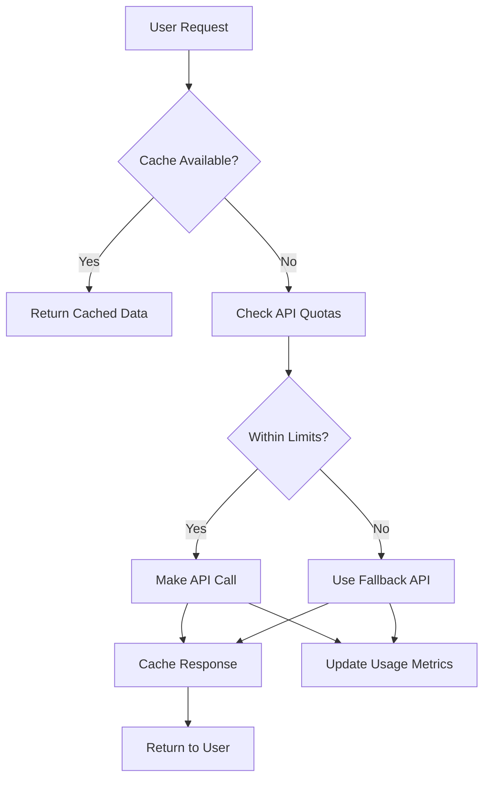
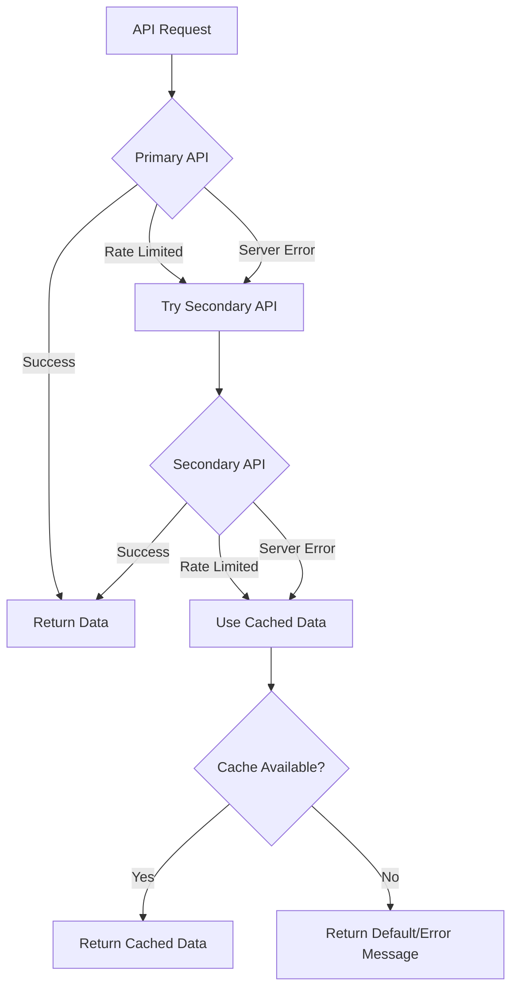

# 05 — API miễn phí cho TravelSense v2

## Danh sách API miễn phí và rẻ

### 🗺️ Maps & Geocoding

#### OpenStreetMap (Hoàn toàn miễn phí)
```yaml
Service: Nominatim Geocoding
Endpoint: https://nominatim.openstreetmap.org/
Limits: 1 request/second, fair use policy
Features:
  - Geocoding/Reverse geocoding
  - Address lookup
  - Points of Interest
  - No API key required
Usage: "Tìm tọa độ địa điểm, reverse geocoding"
```

#### MapBox (Free tier)
```yaml
Service: MapBox APIs
Endpoint: https://api.mapbox.com/
Free Tier: 50,000 requests/month
Features:
  - Maps, Geocoding, Directions
  - Matrix API (travel times)
  - Static maps
API Key: Required (free signup)
Usage: "Tính toán tuyến đường, ma trận thời gian di chuyển"
```

### 🌤️ Weather Data

#### OpenWeatherMap (Free tier)
```yaml
Service: OpenWeatherMap API
Endpoint: https://api.openweathermap.org/
Free Tier: 1000 calls/day, 60 calls/minute
Features:
  - Current weather
  - 5-day forecast
  - Historical data (limited)
  - Weather alerts
API Key: Required (free signup)
Usage: "Dự báo thời tiết cho lịch trình"
```

#### WeatherAPI (Free tier)
```yaml
Service: WeatherAPI
Endpoint: https://api.weatherapi.com/
Free Tier: 1 million calls/month
Features:
  - Current conditions
  - 3-day forecast
  - Historical weather
  - Astronomy data
API Key: Required (free signup)
Usage: "Backup cho OpenWeatherMap, dữ liệu chi tiết hơn"
```

### 📍 Places & Points of Interest

#### Foursquare Places API (Free tier)
```yaml
Service: Foursquare Places
Endpoint: https://api.foursquare.com/
Free Tier: 1000 calls/day
Features:
  - Venue search
  - Venue details
  - Photos, tips, hours
  - Categories and ratings
API Key: Required (free signup)
Usage: "Tìm kiếm địa điểm ăn uống, giải trí, tham quan"
```

#### Google Places API (Free tier)
```yaml
Service: Google Places API
Endpoint: https://maps.googleapis.com/maps/api/place/
Free Tier: $200 credit/month (~40,000 requests)
Features:
  - Place search
  - Place details
  - Photos, reviews
  - Opening hours
API Key: Required (credit card for verification)
Usage: "Dữ liệu địa điểm chất lượng cao, reviews"
```

#### Overpass API (Hoàn toàn miễn phí)
```yaml
Service: OpenStreetMap Overpass
Endpoint: https://overpass-api.de/api/
Limits: Fair use policy, no hard limits
Features:
  - POI data from OSM
  - Amenities, tourism spots
  - Custom queries
  - Real-time data
API Key: Not required
Usage: "Tìm kiếm POI theo category, backup data source"
```

### 🏨 Accommodation

#### Booking.com Affiliate API (Miễn phí với commission)
```yaml
Service: Booking.com Partner API
Endpoint: https://partner-api.booking.com/
Cost: Free (commission-based revenue)
Features:
  - Hotel search
  - Availability, pricing
  - Hotel details, photos
  - Booking capabilities
Requirements: Affiliate partnership
Usage: "Tìm kiếm khách sạn với khả năng booking"
```

#### Airbnb API (Không còn public, dùng web scraping)
```yaml
Alternative: Rapid API Airbnb
Endpoint: https://rapidapi.com/DataCrawler/api/airbnb13/
Cost: $0-10/month for basic tier
Features:
  - Property search
  - Pricing, availability
  - Property details
API Key: RapidAPI subscription
Usage: "Tìm kiếm nhà/phòng cho thuê ngắn hạn"
```

### 🚌 Transportation

#### Rome2rio API (Free tier)
```yaml
Service: Rome2rio
Endpoint: https://free.rome2rio.com/api/
Free Tier: 1000 requests/month
Features:
  - Multi-modal transport
  - Route planning
  - Cost estimates
  - Transport timetables
API Key: Required (free signup)
Usage: "Tìm phương tiện di chuyển giữa thành phố"
```

#### Transit API (OpenTripPlanner)
```yaml
Service: OpenTripPlanner
Endpoint: Self-hosted or public instances
Cost: Free (open source)
Features:
  - Public transit routing
  - Multi-modal planning
  - Real-time updates
  - GTFS data integration
Usage: "Lập kế hoạch di chuyển bằng phương tiện công cộng"
```

## Cấu hình API trong project

### Environment Variables
```env
# Maps & Geocoding
MAPBOX_ACCESS_TOKEN=pk.xxx
NOMINATIM_BASE_URL=https://nominatim.openstreetmap.org

# Weather
OPENWEATHER_API_KEY=xxx
WEATHERAPI_KEY=xxx

# Places
FOURSQUARE_API_KEY=xxx
GOOGLE_PLACES_API_KEY=xxx
OVERPASS_API_URL=https://overpass-api.de/api

# Accommodation
BOOKING_PARTNER_ID=xxx
RAPIDAPI_AIRBNB_KEY=xxx

# Transportation
ROME2RIO_API_KEY=xxx
```

### API Service Class (TypeScript)
```typescript
class ExternalAPIService {
  async searchPlaces(query: string, location: [number, number]) {
    // Try Foursquare first (better for restaurants/entertainment)
    try {
      return await this.foursquareSearch(query, location);
    } catch (error) {
      // Fallback to Overpass API
      return await this.overpassSearch(query, location);
    }
  }

  async getWeather(location: [number, number], dates: Date[]) {
    // Try OpenWeatherMap first
    try {
      return await this.openWeatherAPI(location, dates);
    } catch (error) {
      // Fallback to WeatherAPI
      return await this.weatherAPICall(location, dates);
    }
  }

  async findAccommodation(location: [number, number], dates: Date[], guests: number) {
    // Try Booking.com first (hotels)
    const hotels = await this.bookingSearch(location, dates, guests);
    
    // Try RapidAPI Airbnb (apartments/homes)
    const rentals = await this.airbnbSearch(location, dates, guests);
    
    return [...hotels, ...rentals].sort((a, b) => a.price - b.price);
  }
}
```

## Cost Management Strategy

### Request Optimization


### Caching Strategy
```yaml
Cache Levels:
  - Browser: 5 minutes (POI details)
  - Redis: 1 hour (search results)
  - Database: 24 hours (static POI data)

TTL by Data Type:
  - Weather: 30 minutes
  - Places: 6 hours
  - Maps/Routes: 24 hours
  - Accommodation: 2 hours
```

## API Rate Limiting & Error Handling

### Rate Limit Management
```typescript
class RateLimitManager {
  private quotas = new Map<string, {current: number, limit: number, resetTime: Date}>();

  async canMakeRequest(apiName: string): Promise<boolean> {
    const quota = this.quotas.get(apiName);
    if (!quota) return true;
    
    if (new Date() > quota.resetTime) {
      quota.current = 0;
    }
    
    return quota.current < quota.limit;
  }

  async makeRequest<T>(apiName: string, requestFn: () => Promise<T>): Promise<T> {
    if (!(await this.canMakeRequest(apiName))) {
      throw new Error(`Rate limit exceeded for ${apiName}`);
    }
    
    try {
      const result = await requestFn();
      this.incrementUsage(apiName);
      return result;
    } catch (error) {
      if (this.isRateLimitError(error)) {
        await this.handleRateLimit(apiName);
      }
      throw error;
    }
  }
}
```

### Error Handling Hierarchy


## Tích hợp thực tế

### Sample API Calls

#### Tìm kiếm địa điểm với Foursquare
```bash
curl "https://api.foursquare.com/v3/places/search" \
  -H "Authorization: Bearer YOUR_API_KEY" \
  -G \
  -d "query=restaurant" \
  -d "ll=21.0285,105.8542" \
  -d "radius=1000" \
  -d "limit=20"
```

#### Lấy thời tiết với OpenWeatherMap
```bash
curl "https://api.openweathermap.org/data/2.5/forecast" \
  -G \
  -d "lat=21.0285" \
  -d "lon=105.8542" \
  -d "appid=YOUR_API_KEY" \
  -d "units=metric" \
  -d "cnt=40"
```

#### Geocoding với Nominatim
```bash
curl "https://nominatim.openstreetmap.org/search" \
  -G \
  -d "q=Hoan Kiem Lake, Hanoi" \
  -d "format=json" \
  -d "limit=1" \
  -d "addressdetails=1"
```

### Estimated Monthly Costs (USD)

| Service | Free Tier | Estimated Usage | Overage Cost |
|---------|-----------|-----------------|--------------|
| OpenWeatherMap | 1K calls/day | 20K calls/month | $0 |
| Foursquare Places | 1K calls/day | 25K calls/month | $25 |
| MapBox | 50K requests | 60K requests | $5 |
| Google Places | $200 credit | $150 usage | $0 |
| **Total** | | | **$30/month** |

*Estimated for 1000 active users creating 100 trips/month*
