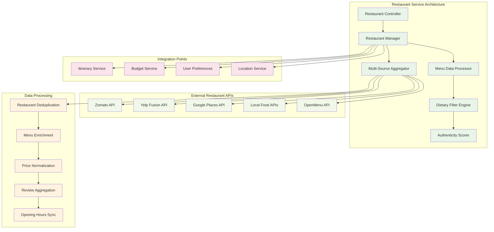
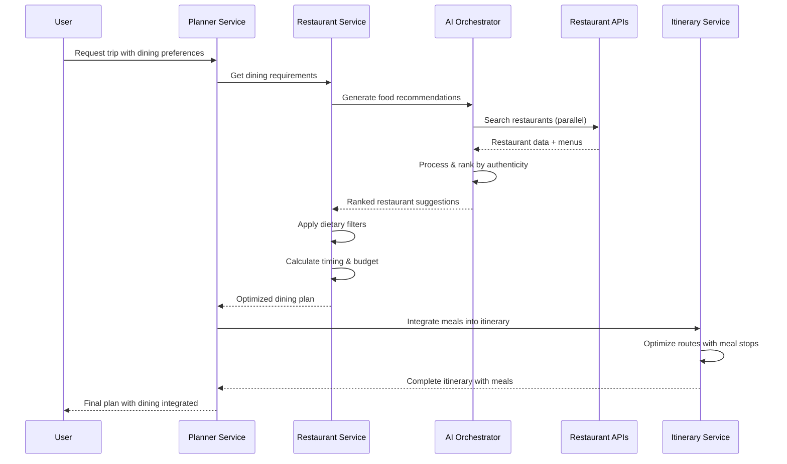
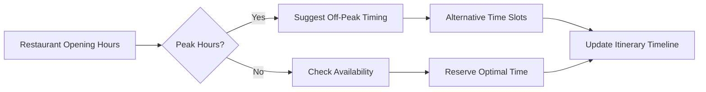

# 06 — Tích hợp Ăn uống & Nhà hàng vào TravelSense v2

## Tổng quan tính năng

**TravelSense v2** giờ đây bao gồm một hệ thống tích hợp ăn uống toàn diện, cho phép người dùng lập kế hoạch bữa ăn cùng với lịch trình du lịch. Tính năng này không chỉ đơn thuần là tìm kiếm nhà hàng, mà còn tích hợp sâu vào quy trình lập kế hoạch với AI optimization, budget planning, và cultural discovery.

## Kiến trúc Restaurant Service



## Luồng xử lý Meal Planning



## Tính năng chính

### 1. Multi-Source Restaurant Discovery

**Comprehensive Coverage**: Tích hợp từ nhiều nguồn để đảm bảo coverage toàn diện:
- **Zomato**: Mạnh về thị trường Châu Á, reviews địa phương
- **Yelp**: Photos chất lượng cao, reviews chi tiết
- **Google Places**: Opening hours chính xác, popular times
- **Local APIs**: Street food, hidden gems, authentic experiences

**Smart Deduplication**: Algorithm thông minh để merge restaurants từ nhiều sources:
```typescript
interface RestaurantDeduplication {
  nameMatching: {
    fuzzyMatchThreshold: 0.85;
    locationRadius: 50; // meters
    synonymDetection: boolean;
  };
  confidenceScoring: {
    sourceReliability: Record<string, number>;
    dataCompleteness: number;
    reviewConsistency: number;
  };
}
```

### 2. Dietary Restrictions & Preferences

**Comprehensive Filtering**:
- Vegetarian/Vegan options với source verification
- Halal/Kosher certification tracking
- Gluten-free menu availability
- Allergy warnings và ingredient information
- Cultural dietary preferences (e.g., no pork, no beef)

**Smart Suggestions**: AI hiểu context và suggest alternatives:
```yaml
Examples:
  - "Vegan traveler in Vietnam" → Local tofu dishes, vegetarian Buddhist restaurants
  - "Halal family in Japan" → Certified halal sushi, Muslim-friendly ramen shops
  - "Gluten-free in Italy" → Certified gluten-free pasta restaurants, risotto specialists
```

### 3. Meal Timing Optimization

**Intelligent Scheduling**:
- **Breakfast Integration**: Hotels với breakfast included vs local breakfast spots
- **Lunch Planning**: Quick options near attractions vs experience dining
- **Dinner Optimization**: Fine dining reservations vs casual local experiences
- **Snack Stops**: Street food discovery between activities

**Opening Hours Intelligence**:


### 4. Budget Integration

**Smart Budget Allocation**:
- **Daily Food Budget**: Automatic allocation based on total trip budget
- **Meal Category Budgeting**: Street food (20%), Local restaurants (50%), Fine dining (30%)
- **Currency Conversion**: Real-time pricing in local currency
- **Group Cost Splitting**: Automatic calculation cho group trips

**Price Intelligence**:
```yaml
Budget Tiers:
  Budget: "$5-15/meal"
    - Street food vendors
    - Local casual dining
    - Food courts & markets
  
  Mid-Range: "$15-35/meal"
    - Popular local restaurants
    - Cuisine-specific specialists
    - Tourist-friendly with quality
  
  Premium: "$35+/meal"
    - Fine dining experiences
    - Michelin recommendations
    - Signature tasting menus
```

### 5. Cultural Food Discovery

**Authenticity Scoring Algorithm**:
```typescript
interface AuthenticityScore {
  localReviewRatio: number; // % of reviews from locals
  touristVsLocalRating: number; // Rating difference analysis
  menuAuthenticity: number; // Traditional dishes vs fusion
  locationContext: number; // Local neighborhood vs tourist area
  pricePoint: number; // Compared to local average
  hiddenGemIndicators: string[]; // Off-beaten-path markers
}

calculateAuthenticity(restaurant: Restaurant): number {
  const score = 
    (restaurant.localReviewRatio * 0.3) +
    (restaurant.menuAuthenticity * 0.25) +
    (restaurant.locationContext * 0.2) +
    (restaurant.pricePoint * 0.15) +
    (restaurant.hiddenGemBonus * 0.1);
  
  return Math.min(score, 1.0);
}
```

**Local Food Culture Integration**:
- **Regional Specialties**: Highlight must-try local dishes
- **Seasonal Recommendations**: Best time for specific cuisines
- **Cultural Context**: Dining etiquette và customs
- **Hidden Gems Discovery**: Local favorites vs tourist traps

## AI-Powered Food Recommendations

### Cheap LLM Tasks
- **Creative Food Discovery**: "Find unique local breakfast experiences"
- **Cultural Insights**: "Explain Vietnamese coffee culture"
- **Casual Recommendations**: "Quick lunch near Hoan Kiem Lake"
- **Street Food Guidance**: "Safe street food options for foreigners"

### Structured LLM Tasks
- **Meal Schedule Optimization**: Complex timing với constraints
- **Dietary Compliance Validation**: Strict verification
- **Budget Allocation**: Mathematical optimization
- **Conflict Resolution**: Handle scheduling conflicts

### Sample AI Interactions

#### Food Discovery Prompt
```
User: "I want authentic Vietnamese breakfast in Hanoi, budget-friendly but clean"

AI Response:
🍜 **Pho Gia Truyen Bat Dan**
- Legendary pho bo since 1950s
- $2-3 per bowl, cash only
- Best time: 6-8 AM before crowds
- Why special: Family recipe, locals' favorite

🥖 **Banh Mi 25**
- Famous banh mi cart, featured in travel guides
- $1.50 per sandwich, multiple fillings
- Best time: 7-11 AM fresh bread
- Try: Pate + grilled pork combination

☕ **Giang Cafe**
- Original egg coffee inventor
- $1.50 per coffee, upstairs seating
- Cultural experience + great photos
- Order: Ca phe trung (egg coffee)
```

## Database Schema

### Restaurant Data Model
```sql
-- Core restaurant information
CREATE TABLE restaurants (
    id UUID PRIMARY KEY,
    name VARCHAR(255) NOT NULL,
    latitude DECIMAL(10, 8),
    longitude DECIMAL(11, 8),
    address TEXT,
    cuisine_types TEXT[], -- Array of cuisine categories
    price_range INTEGER, -- 1-4 scale
    rating DECIMAL(3, 2),
    total_reviews INTEGER,
    phone VARCHAR(50),
    website VARCHAR(255),
    opening_hours JSONB, -- Structured hours data
    features TEXT[], -- outdoor_seating, family_friendly, etc
    dietary_options TEXT[], -- vegetarian, vegan, halal, etc
    authenticity_score DECIMAL(3, 2),
    created_at TIMESTAMP DEFAULT NOW(),
    updated_at TIMESTAMP DEFAULT NOW()
);

-- Menu items and pricing
CREATE TABLE menu_items (
    id UUID PRIMARY KEY,
    restaurant_id UUID REFERENCES restaurants(id),
    name VARCHAR(255) NOT NULL,
    description TEXT,
    price DECIMAL(10, 2),
    currency VARCHAR(3),
    category VARCHAR(100), -- appetizer, main, dessert, beverage
    dietary_tags TEXT[], -- vegan, gluten_free, spicy, etc
    is_signature BOOLEAN DEFAULT FALSE,
    image_url VARCHAR(500),
    created_at TIMESTAMP DEFAULT NOW()
);

-- User meal plans
CREATE TABLE user_meal_plans (
    id UUID PRIMARY KEY,
    trip_id UUID REFERENCES trips(id),
    meal_date DATE,
    meal_type VARCHAR(20), -- breakfast, lunch, dinner, snack
    restaurant_id UUID REFERENCES restaurants(id),
    planned_time TIME,
    group_size INTEGER,
    estimated_cost DECIMAL(10, 2),
    dietary_notes TEXT,
    status VARCHAR(20) DEFAULT 'planned', -- planned, confirmed, completed
    created_at TIMESTAMP DEFAULT NOW()
);

-- Restaurant reviews aggregation
CREATE TABLE restaurant_reviews_summary (
    restaurant_id UUID REFERENCES restaurants(id),
    source VARCHAR(50), -- zomato, yelp, google, local
    total_reviews INTEGER,
    average_rating DECIMAL(3, 2),
    last_updated TIMESTAMP,
    review_highlights TEXT[], -- Top positive/negative themes
    PRIMARY KEY (restaurant_id, source)
);
```

## API Endpoints

### Restaurant Discovery
```yaml
GET /api/restaurants/search
Parameters:
  - location: lat,lng or address
  - radius: search radius in meters
  - cuisine: cuisine type filter
  - price_range: 1-4 price level
  - dietary: dietary restrictions array
  - meal_type: breakfast/lunch/dinner
  - authenticity_min: minimum authenticity score
  - open_now: boolean
  - group_size: number of people

Response:
  restaurants: [
    {
      id: uuid,
      name: string,
      location: {lat, lng},
      cuisine_types: string[],
      price_range: number,
      rating: number,
      authenticity_score: number,
      distance_meters: number,
      opening_hours: object,
      highlights: string[],
      estimated_cost_per_person: number
    }
  ],
  total_count: number,
  search_metadata: object
```

### Meal Planning Integration
```yaml
POST /api/trips/{trip_id}/meal-plan
Body:
  preferences: {
    dietary_restrictions: string[],
    cuisine_preferences: string[],
    budget_per_day: number,
    meal_times: {
      breakfast: string,
      lunch: string, 
      dinner: string
    },
    authenticity_preference: number, // 0-1 scale
    group_size: number
  }

Response:
  meal_plan: {
    daily_schedules: [
      {
        date: string,
        meals: [
          {
            meal_type: string,
            restaurant: object,
            planned_time: string,
            estimated_cost: number,
            travel_time_from_previous: number,
            menu_recommendations: object[]
          }
        ],
        daily_food_budget: number,
        budget_remaining: number
      }
    ],
    total_estimated_cost: number,
    dietary_compliance: boolean,
    optimization_score: number
  }
```

## Performance Optimizations

### Caching Strategy
```yaml
Cache Layers:
  Restaurant Search Results:
    TTL: 4 hours
    Key Pattern: "restaurants:{lat}:{lng}:{radius}:{filters_hash}"
    
  Menu Data:
    TTL: 24 hours  
    Key Pattern: "menu:{restaurant_id}"
    
  Opening Hours:
    TTL: 1 week
    Key Pattern: "hours:{restaurant_id}"
    
  Popular Recommendations:
    TTL: 2 hours
    Key Pattern: "popular:{location_hash}:{meal_type}"
```

### Database Optimizations
```sql
-- Geospatial indexing for location-based searches
CREATE INDEX idx_restaurants_location ON restaurants 
USING GIST (ll_to_earth(latitude, longitude));

-- Composite index for common filter combinations
CREATE INDEX idx_restaurants_search ON restaurants 
(cuisine_types, price_range, rating, authenticity_score);

-- Full-text search for restaurant names and descriptions
CREATE INDEX idx_restaurants_search_text ON restaurants 
USING GIN (to_tsvector('english', name || ' ' || COALESCE(description, '')));
```

## Integration với existing services

### Itinerary Service Integration
- **Route Optimization**: Include meal stops trong route calculation
- **Timing Coordination**: Ensure meal times don't conflict với activities
- **Location Clustering**: Group nearby meals với attractions

### Budget Service Integration
- **Cost Allocation**: Automatic food budget từ total trip budget
- **Real-time Tracking**: Update remaining budget after meal confirmations
- **Currency Conversion**: Handle multi-currency meal costs

### User Preference Learning
- **Cuisine Learning**: Track preferred cuisines và adjust recommendations
- **Budget Pattern Recognition**: Learn user's actual vs planned spending
- **Authenticity Preference**: Adjust authenticity scoring based on choices

## Monitoring & Analytics

### Key Metrics
```yaml
Business Metrics:
  - Restaurant recommendation acceptance rate
  - Meal plan completion rate
  - Average food budget accuracy
  - User satisfaction with dining suggestions
  - Revenue from restaurant affiliate partnerships

Technical Metrics:
  - API response times for restaurant searches
  - Cache hit rates for restaurant data
  - Data freshness for opening hours/menus
  - Restaurant data source availability
  - Deduplication accuracy rates
```

### Success Criteria
- **85%+ dietary restriction compliance** trong recommendations
- **<500ms average response time** cho restaurant searches
- **70%+ meal plan completion rate** by users
- **90%+ budget accuracy** within 20% variance
- **4.5+ rating** for dining suggestions quality

Với tính năng ăn uống tích hợp này, **TravelSense v2** trở thành một platform hoàn chỉnh cho travel planning, không chỉ giúp người dùng khám phá điểm đến mà còn trải nghiệm văn hóa ẩm thực local một cách authentic và có tổ chức.
